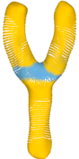
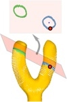
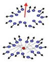

# Curve-skeleton Extraction from Incomplete Point Cloud

## Abstract
We present an algorithm for curve skeleton extraction from imperfect point clouds where large portions of the data may be missing. Our construction is primarily based on a novel notion of generalized rotational symmetry axis (ROSA) of an oriented point set. Specifically, given a subset S of oriented points, we introduce a variational definition for an oriented point that is most rotationally symmetric with respect to S. Our formulation effectively utilizes normal information to compensate for the missing data and leads to robust curve skeleton computation over regions of a shape that are generally cylindrical. We present an iterative algorithm via planar cuts to compute the ROSA of a point cloud. This is complemented by special handling of non-cylindrical joint regions to obtain a centered, topologically clean, and complete 1D skeleton. We demonstrate that quality curve skeletons can be extracted from a variety of shapes captured by incomplete point clouds. Finally, we show how our algorithm assists in shape completion under these challenges by developing a skeleton-driven point cloud completion scheme.

## BibTex

    @article {rosa_sig09,
    title = {Curve Skeleton Extraction from Incomplete Point Cloud},
    author = {Andrea Tagliasacchi and Hao Zhang and Daniel Cohen-Or},
    journal = {ACM Transactions on Graphics (Proc. SIGGRAPH)},
    year = {2009}}

## Brief description

<table style="width:100%">
<tr>
 <td style="width:30%"></td>
 <td>
Based on the model of generalized rotational symmetry we develop an algorithm for curve-skeleton extraction from incomplete point clouds. Articulated shapes are generally composed by two types of regions: branch regions, which are associated with generalized rotational symmetry and joint regions, which are not.
  
This intuition is easily observable in the figure here on the left, where a shape is composed by three branches joining together in the middle, forming a letter Y shape. Colors in the figure illustrate which regions of the shape are considered as branches and which are considered a joints.
  </td>
</tr>
<tr>
 <td style="width:30%"></td>
 <td>
Rotational symmetry for a surface sample is characterized by: (1) A rotational symmetry center, (2) A rotational symmetry axis (direction). We solve the problem of finding these two elements by observing that the symmetry axis can also be represented in terms of a cutting plane, perpendicular to the symmetry axis. Intuitively, the symmetry center should lie on this plane.
  </td>
</tr>
<tr>
 <td style="width:30%"></td>
 <td>
Given the samples lying on a candidate cutting plane, we propose an optimization problem that is able to identify candidates for a meaningful rotational symmetry axis and rotational symmetry center, a "ROSA point" whoese (1) axis minimizes the sum of angular distances with the sample normals and (2) center minimizes the sum of distances to normal lines.
  </td>
</tr>
</table> 

